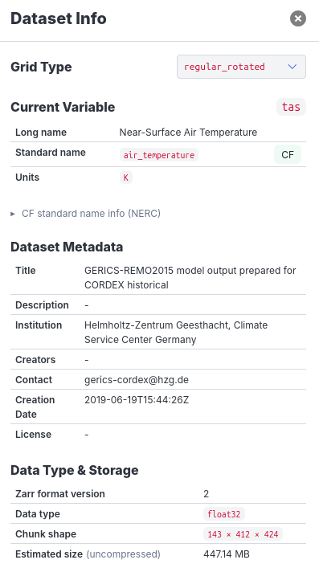
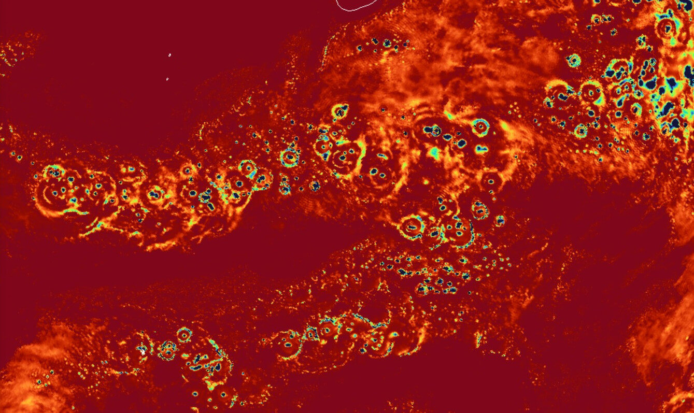
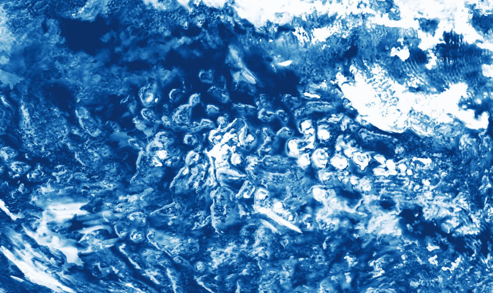

# Gridlook

Andrej Fast¹, Tobi Kölling², Fabian Wachsmann¹, and contributors

¹DKRZ, ²MPI-M

Gridlook is a browser-based WebGL viewer for interactive exploration of
cloud-hosted Zarr datasets and Icechunk repositories containing Earth system
model (ESM) output on native grids.

- [Open Gridlook](https://gridlook.pages.dev/)
- [Read the EGU26 publication](https://www.egu26.eu/EGU26-9862.html)

## Documentation index

### Using Gridlook

- [Controls](Controls.md) — keyboard, mouse, touch, streamlines, and presenter
  controls.
- [Supported grid types](grid-types.md) — grid families, automatic detection,
  and alternative renderers.

### Providing data

- [Catalogs](catalogs.md) — catalog schema, hosting, and shareable catalog URLs.
- [Live-dataset server contract](live-datasets.md#server-contract) — endpoints
  required by live mode.
- [CORS and data hosting](../README.md#cors--hosting-notes) — browser access
  requirements and a header check.

## Capabilities

- Explore model output without installing desktop software, logging in to an
  HPC system, or generating map tiles first.
- Render regular and unstructured native grids without regridding, with
  automatic grid detection from dataset metadata.
- Fetch data directly from public Zarr stores and Icechunk repositories and
  project, color, and render it in the browser with WebGL.
- Use interactive 3D and flat projections, scientific colormaps, histograms,
  range selection, auto-contrast, hover readout, and snapshot export.
- Add coastlines, graticules, land and sea masks, texture layers, and animated
  streamlines.
- Share the dataset, variable, projection, and view parameters through a URL
  (remote datasets only; see [Open a dataset](#open-a-dataset)).
- Browse grouped datasets through catalogs or follow a running simulation in
  live mode.
- Open a local Zarr store or a local NetCDF file directly from your file
  system, without uploading it anywhere.

## Dataset information

- Open the **Dataset Info** panel to inspect the metadata of a dataset
- Review the current variable's long name, standard name, units, and CF
  standard-name information.
- Check standard name-details provided by [The NERC Vocabulary Server (NVS), National Oceanography Centre – BODC](https://vocab.nerc.ac.uk/)
- Inspect dataset metadata, available variables and dimensions, spatial
  coverage, data type, chunk shape, and estimated uncompressed size.



## Layers

- Organize the data grid, coastlines, graticules, masks, streamlines, and custom
  texture layers in one layer stack.
- Drag layers to change their drawing order, toggle their visibility, and
  adjust opacity where supported.
- Import custom PNG, JPG, and GeoTIFF files as image layers.
- Create a GeoTIFF image layer from the currently loaded data and add it to the
  layer stack.

## Open a dataset

- Start with the [hosted Gridlook application](https://gridlook.pages.dev/).
- Open a Zarr dataset or Icechunk repository directly with this URL pattern:

  ```text
  https://gridlook.pages.dev/#<ZARR_OR_ICECHUNK_URI>
  ```

- Use a publicly reachable Zarr or Icechunk URI that allows browser requests
  through CORS. Icechunk repositories can use an `icechunk+https://` URI.
- Open multiple related datasets through a [Gridlook catalog](catalogs.md).
- Follow a changing dataset by adding `::live=true`; see
  [Live datasets](live-datasets.md).
- Use the [controls guide](Controls.md) for keyboard, mouse, touch, streamline,
  and presenter controls.

### Local Zarr and NetCDF files

- In the "Open dataset" dialog, use **Local Zarr** to select a local Zarr
  dataset directory, or **Local NetCDF** to select a local `.nc`/`.nc4`/`.cdf`
  file. Both are read directly in the browser; nothing is uploaded to a
  server.
- Only one local dataset can be open at a time — opening another local file
  or directory replaces the previous one.
- **Local datasets cannot be shared or restored through a URL.** Gridlook's
  URL only records a reference to the selected file, not its content, so
  reloading the page, following a shared link, or using the share/QR-code
  feature will not reopen a local dataset — you must re-select the file or
  directory each time. URL-based sharing works only for remote, publicly
  reachable Zarr or Icechunk datasets.

## Supported grids

- Regular latitude-longitude grids, including Web Mercator and zonal means.
- Rotated regular latitude-longitude grids, including CORDEX output.
- Curvilinear grids, including ocean-model grids.
- Reduced Gaussian grids, including IFS-style products.
- HEALPix grids, including ICON and HEALPix-remapped output.
- Triangular grids, including native ICON output.
- Irregular and unstructured grids, including AWI-CM and FESOM output.

See [Supported grid types](grid-types.md) for detection rules and rendering
alternatives.

## Examples

- [Triangular: EERIE ICON historical near-surface temperature on R2B8](https://gridlook.pages.dev/#https://gridlook.pages.dev/static/index_mr_dpp0066.json::varname=sfcwind::dimIndices_time=1)
- [Regular: CMIP6 EC-Earth3P-HR precipitation](https://gridlook.pages.dev/#https://storage.googleapis.com/cmip6/CMIP6/HighResMIP/EC-Earth-Consortium/EC-Earth3P-HR/highresSST-present/r1i1p1f1/Amon/pr/gr/v20170811/)
- [Rotated regular: EURO-CORDEX REMO2015 near-surface temperature](https://gridlook.pages.dev/#https://euro-cordex.s3.amazonaws.com/CMIP5/cordex/output/EUR-11/GERICS/MPI-M-MPI-ESM-LR/historical/r3i1p1/REMO2015/v1/mon/tas/v20190925/)
- [Reduced Gaussian: EERIE IFS historical output on TCO1279](https://gridlook.pages.dev/#https://eerie.cloud.dkrz.de/datasets/ifs-amip-tco1279.hist.v20240901.atmos.native.2D_monthly/stac)
- [Healpix](https://gridlook.pages.dev/#https://s3.waterpark.dkrz.de/eerie/eerie-future-ssp245-v20240618_P1M_mean_7.zarr)
- [Irregular: CMIP6 AWI-CM historical sea-surface temperature](https://gridlook.pages.dev/#https://cmip6-pds.s3.amazonaws.com/CMIP6/CMIP/AWI/AWI-CM-1-1-MR/historical/r1i1p1f1/Oday/tos/gn/v20181218/)

## Use cases

- Embed interactive model views in web applications, including mobile layouts.
- Understand model internals, such as ring-shaped precipitation in IFS
- Find bugs and diagnose model output, such as the
  [Amazon River temperature anomaly in CMIP6 MPI-ESM1-2](https://gridlook.pages.dev/#https://storage.googleapis.com/cmip6/CMIP6/ScenarioMIP/DKRZ/MPI-ESM1-2-HR/ssp370/r1i1p1f1/Amon/tas/gn/v20190710/).

| IFS DYAMOND3 precipitation over the Indian Ocean                                              | IFS DYAMOND3 cloud cover over the Pacific                                  |
| --------------------------------------------------------------------------------------------- | -------------------------------------------------------------------------- |
|  |  |

## Technology

- TypeScript and Vue.js for the application.
- Bulma for the interface.
- Three.js and WebGL for rendering.
- Zarrita for Zarr dataset access and `icechunk-js` for Icechunk repository
  access.

## Publication

- [Gridlook: Interactive Visualization of Cloud-Hosted Earth System Model
  Output on Native Grids — EGU26-9862](https://www.egu26.eu/EGU26-9862.html)
