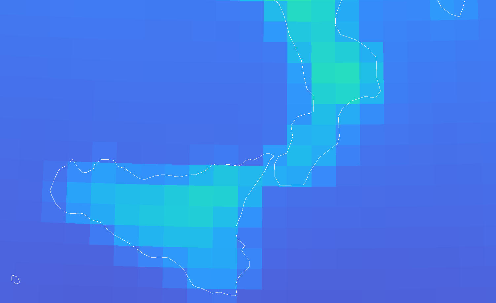
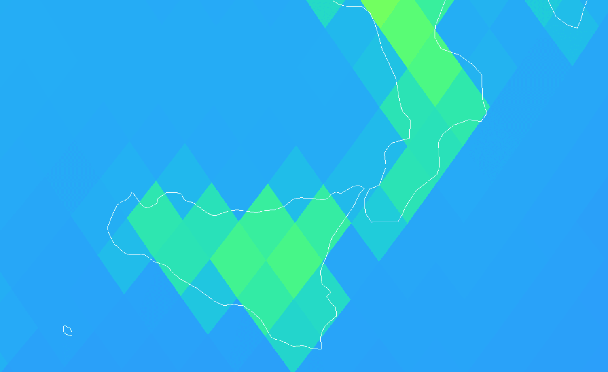
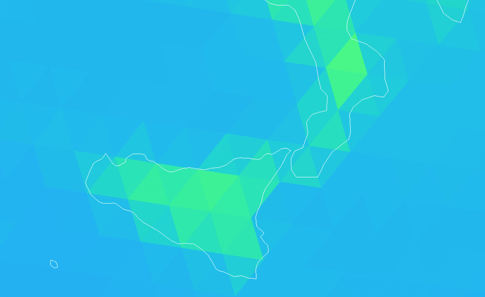
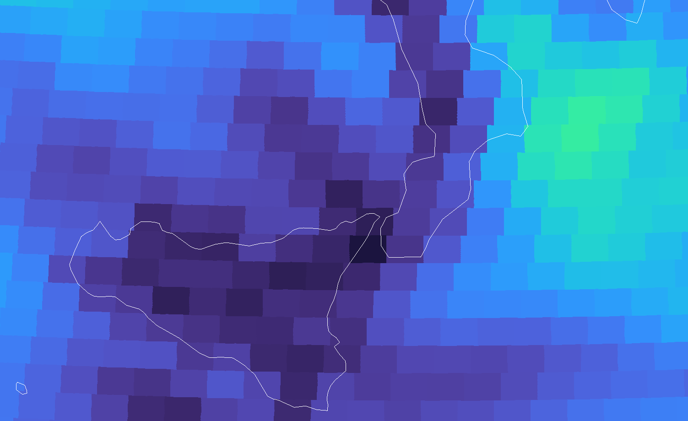
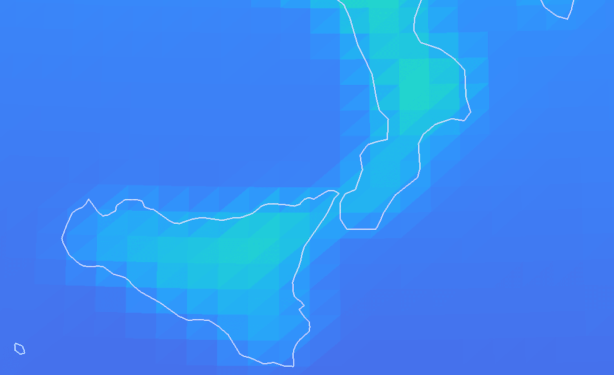
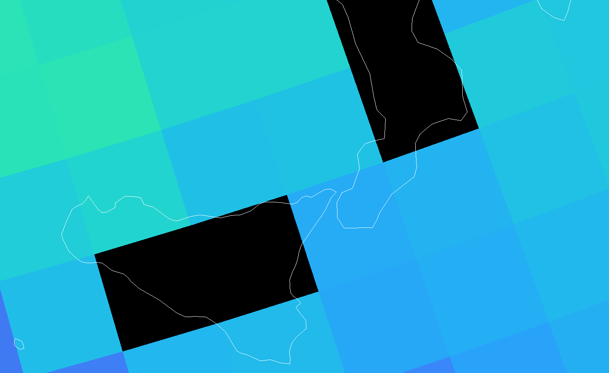

# Supported Grid Types

Gridlook supports the following grid types. Select a preview to open the
full-size cutout.

| Grid type            | Description                                              | Automatically detected | Preview                                                                                                                                                      |
| -------------------- | -------------------------------------------------------- | ---------------------- | ------------------------------------------------------------------------------------------------------------------------------------------------------------ |
| `regular`            | Rectilinear lat/lon, latitude-only, or Web Mercator grid | Yes                    |                                         |
| `regular_rotated`    | Rotated regular latitude/longitude grid                  | Yes                    | —                                                                                                                                                            |
| `healpix`            | HEALPix discrete global grid                             | Yes                    |                                       |
| `triangular`         | Unstructured triangular grid, such as ICON               | Yes                    |                               |
| `gaussian_reduced`   | Reduced Gaussian grid                                    | Yes                    |               |
| `irregular`          | Unstructured grid represented by lat/lon pairs           | Yes                    |                                 |
| `irregular_delaunay` | Irregular grid rendered with Delaunay triangles          | No                     |  |
| `curvilinear`        | Grid whose latitude and longitude are 2-D arrays         | Yes                    |                                       |

`error` also exists internally, but it represents failed detection rather than a
supported grid.

## Detection order

Grid detection is first-match-wins. Gridlook applies the following checks to the
selected data variable in order:

1. **Triangular topology**

   If a `vertex_of_cell` variable exists in the grid source, the grid is
   `triangular`. The variable is resolved relative to the selected data
   variable when it is inside a group.

2. **CRS metadata**

   Gridlook locates the CRS variable using the selected variable's
   `grid_mapping` attribute, the parent group's `grid_mapping` attribute, a
   `spatial_ref` entry in `coordinates`, or the fallback name `crs`. It reads
   the CRS variable's `grid_mapping_name` attribute:

   | `grid_mapping_name`          | Detected type     |
   | ---------------------------- | ----------------- |
   | `healpix`                    | `healpix`         |
   | `rotated_latitude_longitude` | `regular_rotated` |
   | `polar_stereographic`        | `curvilinear`     |

   Polar stereographic data uses the curvilinear renderer because its projected
   x/y axes must be converted into 2-D latitude/longitude coordinates.

3. **Zarr convention metadata**

   If the selected variable's parent group has a `zarr_conventions` attribute
   and a `dggs` object whose `name` is `healpix`, the grid is `healpix`. Other
   DGGS names are currently unsupported and result in `error`.

4. **Dimension names**

   A variable is `regular` when its dimensions contain:

   - both a latitude and a longitude dimension, or
   - a latitude dimension without a longitude dimension, for zonally averaged
     data.

   Gridlook recognizes the local dimension names `lat`, `latitude`, and `rlat`
   as latitude, and `lon`, `longitude`, and `rlon` as longitude. Name matching
   is case-sensitive.

5. **Latitude/longitude coordinate data**

   If the preceding checks do not match, Gridlook reads the latitude and
   longitude coordinates:

   - Two-dimensional latitude and longitude arrays are `curvilinear`.
   - One-dimensional paired coordinates are `gaussian_reduced` when the first
     two latitude values are equal and the number of distinct latitudes
     multiplied by the number of distinct longitudes differs from the product
     of the two coordinate-array lengths.
   - Any other readable latitude/longitude pairs are `irregular`.

6. **Projected x/y fallback**

   If latitude/longitude coordinates cannot be read and the dimensions contain
   both `x` and `y`, Gridlook reads CRS WKT from `crs_wkt`, `spatial_ref`, or
   `projection`:

   - Web Mercator is `regular`.
   - Any other available CRS WKT is `curvilinear`.
   - Missing CRS WKT falls back to `regular`.

If none of these checks succeeds, Gridlook reports `error`.

## Manual rendering alternatives

Some detected grids can be displayed with another supported renderer. The Grid
Type selector offers these alternatives:

| Detected type      | Alternative renderers             |
| ------------------ | --------------------------------- |
| `regular`          | `irregular`, `irregular_delaunay` |
| `regular_rotated`  | `irregular`, `irregular_delaunay` |
| `curvilinear`      | `irregular`, `irregular_delaunay` |
| `gaussian_reduced` | `irregular`, `irregular_delaunay` |
| `irregular`        | `irregular_delaunay`              |

This is how `irregular_delaunay` is normally selected: it is supported as a
rendering mode but has no automatic detection rule of its own.
